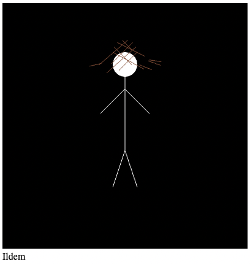

# Ildem_Drawing



## Overview
The **Ildem_Drawing** project is a WebGL-based drawing of **Ildem Gür**, created using a stick-figure style. The figure is rendered using JavaScript and WebGL techniques. The project uses basic WebGL to render shapes, colors, and transformations to create a dynamic figure on an HTML canvas.

## Features
- A stick-figure drawing with a head, torso, arms, and legs.
- Simple hair drawn using vertices and lines.
- Customizable colors for the figure and features.

## Technologies Used
- **WebGL**: For rendering the stick-figure and applying transformations.
- **JavaScript**: Handles the WebGL drawing logic and animation.
- **HTML5**: For the canvas element to render WebGL content.

## Installation

To use this project, follow the steps below:

### Prerequisites
- A modern web browser that supports WebGL (e.g., Chrome, Firefox, Safari).

### Steps
1. Clone or download the repository to your local machine.
2. Open the `index.html` file in your browser to view the WebGL-rendered drawing of Ildem Gür.

   Alternatively, you can run a local web server to serve the files:
   - If you have Python installed, navigate to the project folder and run:
     ```bash
     python3 -m http.server
     ```
   - Then, open `http://localhost:8000` in your browser.

## Usage
- Upon opening the `index.html` file, you'll see the WebGL canvas displaying the stick-figure.
- The figure includes a face with eyes and a smile, and some basic hair.
- The project uses WebGL to draw the figure and animate parts of it, such as the head and limbs.

## Customization
You can adjust the following elements by modifying the `stick-figure.js` file:
- **Hair**: The number and curve of hair strands can be customized.
- **Colors**: Change the RGBA values in the `stick-figure.js` to modify the figure's body, face, and hair colors.
- **Size and Position**: You can scale and reposition the figure by modifying the vertex positions and canvas settings.

## File Structure
- **index.html**: The main HTML file that loads and displays the WebGL canvas.
- **stick-figure.js**: The JavaScript file containing the WebGL logic for rendering the stick-figure.

## Contributing
Feel free to fork the repository and contribute by:
- Adding more features, such as animations or interactivity.
- Customizing the drawing (e.g., different poses or expressions).
- Improving the WebGL rendering performance or adding additional effects.

## License
This project is open-source

## Acknowledgments
- WebGL resources and tutorials for helping understand and implement the rendering techniques.
- The WebGL community for support and ideas.


